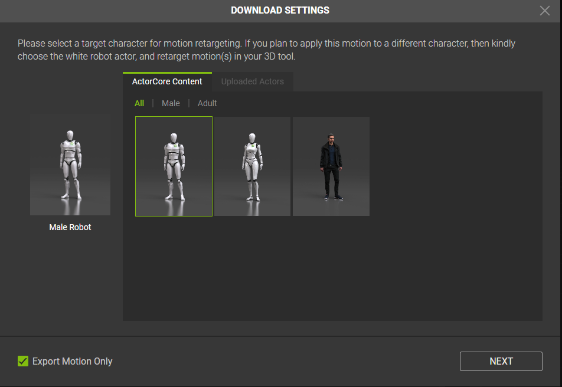
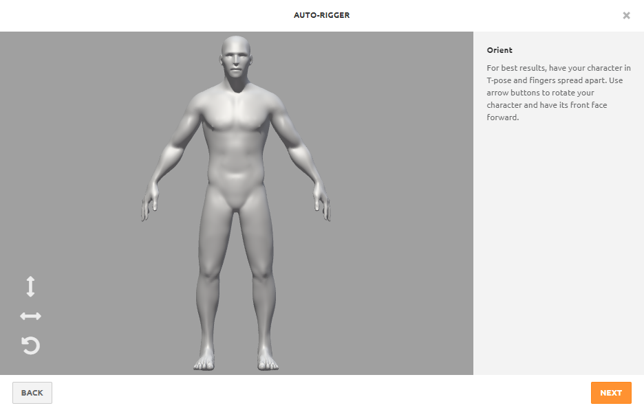

# Art Pipeline

# NOTE : AccuRig is the preferred rigging platform, but the capability with mixamo is complicated. With this in mind, for the timeframe we will be using mixamo's auto-rigging however, keeping the documentation on AccuRig because if the project continues this would be the preferred method.

## Create an ActorCore Account

Navigate to [ActorCore](https://actorcore.reallusion.com/auto-rig) and click on **Free Download** then register an account to download the product. Once it's downloaded, open and install it.

After installing, open the application and sign in with the account you have created.

## Using AccuRig

### Loading your model

AccuRig should open directly to a menu where you can upload your character. Simply click on **Choose File** and select the file from your computer.

After your model has loaded, a line will appear on screen over the model. This line will need to be placed in the middle of their hips (aka down the center of their body).

After you've placed the line correctly, simply hit the button in the bottom right-hand corner labeled "Rig Body".

Once the body has been rigged, we get to the stage where you can edit the placement of the joints that have been set automatically. The joints that are set are as listed: head, neck, right clavicle, left clavicle, right humerus, left humerus, right forearm, left forearm, right hand, left hand, pelvis, right thigh, left thigh, right calf, left calf, right foot, left foot, right toe base, and left toe base.

To edit an individual joint, simply click on it and you can move it as you please. On the right-hand side of the screen, after clicking on an individual joint there are a variety of customization options. You can have the joint mirror to it's right/left counterpart, you can edit the size, opacity, the midpoint placement, snap it to the center plane, and add a mask.

After you've finished placing the body joints, proceed in the bottom right hand corner to rigging the right hand. To do this, press the button "Rig Right Hand". 

After clicking this button, you will be presented with a question that has a drop down menu. In this menu, you must select how many fingers your right hand will have. Then after determining that number, hit "Next".

After the right hand is rigged, the process is the exact same for editing joints. After you've finished the right hand, press the "Rig Left Hand" button.

The left hand will be exactly the same as the right. Once you've finished rigging the left, press the "Finalize Character" button.

After clicking that button, you may have to wait for a bit depending on how fast your machine is. Once you've gotten to this screen where the model is loaded, you have a few options. You can select different test poses or animations in the top right and preview them.

You can move around individual joints simply by selecting the joint in the drop-down menu under "Pose Offset" and editing the X, Y, and Z coordinates.

During this stage, if you notice during any of the poses or animations that something is off, on the left-hand side you can navigate to the previous steps to edit the body or hand rig.

After you're satisfied, hit the "Export" button in the bottom right-hand corner to export your model. 

Once you've hit this button, it will bring up a menu. There will be three options: Export FBX, Export USD (Omniverse), and Save iAvatar (iClone 8). The option we are looking for is Export FBX.

Once you've hit that, you will be brought into another menu. In this menu, we can select our target application (the type of export) and the texture size. In our case, we will be selecting "Unreal" from the drop-down menu for "Target Application" and for Max Texture Size we will keep it at "Original". 

Then hit the "Export" button and select where you want to save your file.

## Downloading Animations from AccuRig

AccuRig provides some free animation options, but most are paid. To get these animations you have to navigate to this site [accuRigMotion](https://actorcore.reallusion.com/motion). Once you're here, you can browse the many animations. 

Once you've selected an animations, simply click on it to preview it and if you like it, select "Add to Cart (Motion)".

Now, if you're ready to checkout, you can select the cart in the top right-hand corner. Here you will checkout like any normal store. Once you've checked out, you will be able to select the button "Download in my inventory". This will redirect you to your online inventory.

Once you're in your inventory, select the animation you'd like to download. Then hit the "Download" button in the bottom right-hand corner.

This will bring up a menu where you can do a couple things. First you can select any actor you've bought through AccuRig or uploaded yourself and it will automatically put the animation onto them. If you don't want to do this, you can simply select the checkmark "Export Motion Only". Then hit next.

You will then reach the next menu which has two panels. The first panel you can ignore if you aren't exporting the animation with a model, but if you are you can select things like the maximum texture size, facial blended shapes, and embedded textures. The panel on the right however, is what we will focus on. You can select the "Target Application", the "FPS", mirroring the animation, and doing "Zero Root Animation". Mirroring the animation will just create the animation you've selected but mirrored to the opposite side. Zero Root Animation is useful for animations that causes the model to stray out of camera view. If this is selected, the character will do the animation in the same spot as they started within camera view. If this isn't selected, the character's pivot will be locked but they can move around the camera view as they please. For our purposes, we will select "Unreal" as the "Target Application", "60" as the "FPS" and "Zero Root Animation". Once you've selected your options and you're satisfied, hit the "Download" button in the bottom right.

This will then compress the file on AccuRig's side and automatically download it to your machine. To access this animation, you must unzip the file. 

## Using Mixamo for Animations

Navigate to [Mixamo](www.mixamo.com) and login with your Adobe account. After you've done that, you have two options. You can either use the Adobe characters by navigating to the "Characters" tab in the top right and selecting one, or you can upload your own character. For our purposes, we will upload our own character. Simply click on the "Upload Character" button and you will be presented with this menu.

Drag and drop your file into this menu, we will be using a .OBJ file. Wait for Mixamo to process the character. Once it's processed you will be greeted with this menu, if all looks good you can hit "Next".

Once you've hit next, this is where we will place our joints. Place the joints as you see fit onto your model. Once you've finished, hit "Next".

Once you've hit next, it will take a moment to auto-rig on Mixamo's side. If you're satisfied with the way your character looks after being rigged, then hit "Next".

Now, once it's uploaded navigate to the "Animations" tab in the top left corner. From here you can select different animations and preview how the look on your model. Once you've selected an animation you'd like to use, click the "Download" button on the right panel.

You will then be brought to this menu where you can select the format, skin, FPS, and keyframe reduction. For us, we will be selecting FBX Binary(.fbx) for the format, Skin is dependent on the model, FPS will be 60, and no keyframe reduction.

Once you're satisfied with the above screenshot, press "Download". Mixamo will then prepare the download and download it to your machine.

## How to import 3D models / images in Unreal

## Creating a Player Unit

The **BP_PlayerUnitBase** *needs* to be selected when creating a new unit.

For further explanation please refer to [jRPG-Documentation](https://docs.google.com/document/d/1NqsJhT1TMfxWrWhaA9jafYDIJ5gpT3rS1UkIAOG4lP0/edit#) section 3.3 and the text there.

## Connecting Models to a Character

The **Big Image** tab of the **BP_PlayerUnitBase** is responsible for the image that shows up during the UI details.

**Battle Image** is image shown during the battle.

**Thumbnail** is the image shown during the character summary UI and in the battle details UI. This will be the character showing during the battle scene. 

## Rigging Models

Player animations can be set under the **Animations** tab inside the **BP_PlayerUnitBase**. For an illustration, look at section 3.3.3 in [jRPG-Documentation](https://docs.google.com/document/d/1NqsJhT1TMfxWrWhaA9jafYDIJ5gpT3rS1UkIAOG4lP0/edit#).

Variables are associated to each animation and can be edited inside the **A_BattleAnimationBlueprint**. Navigate to **Event_Graph** and copy all the nodes and paste in the animation in the blueprint. Right click on the set variable nodes and create them. Illustration shown in 3.3.4 in [jRPG-Documentation](https://docs.google.com/document/d/1NqsJhT1TMfxWrWhaA9jafYDIJ5gpT3rS1UkIAOG4lP0/edit#). You will also need tod o the same for AnimGraph which is also illustrated in section 3.3.4.

## Customizing / Adding Items

## Changing Terrain

## References

[jRPG-Documentation](https://docs.google.com/document/d/1NqsJhT1TMfxWrWhaA9jafYDIJ5gpT3rS1UkIAOG4lP0/edit#)

## Back to main

[Main](README.md)